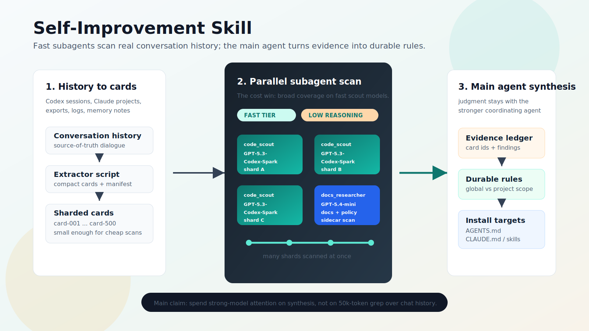

# Self-Improvement Skill



Self-Improvement is a portable agent skill for turning real conversation history into better operating rules. It is designed for Codex, Claude Code, and generic agents that support filesystem-installed skills.

The core move is broad evidence coverage: shard conversation history into compact cards, let fast `GPT-5.3-Codex-Spark` scout subagents scan many shards in parallel, then have the main agent synthesize durable rules, config updates, and follow-up tests.

## Install in One Prompt

Copy this prompt into Codex, Claude Code, or another local coding agent:

```text
Install the Self-Improvement Skill from GitHub.

Repository: https://github.com/Chenwei-1999/agent-self-improvement.git

Steps:
1. Clone the repository into a temporary directory.
2. From the cloned repository, run:
   python3 scripts/install_skill.py --target all --force
3. Verify the package:
   python3 -m unittest discover -s tests -v
4. Report the installed paths:
   ~/.codex/skills/self-improvement
   ~/.claude/skills/self-improvement
   ~/.agents/skills/self-improvement

Do not edit unrelated global config. If a target runtime does not use one of
those skill directories, explain that compatibility note instead of guessing.
```

## Why It Exists

Most agent "self-improvement" drifts into vibes or hand-picked examples. This package keeps it grounded:

- Uses actual Codex and Claude conversation history.
- Dispatches `GPT-5.3-Codex-Spark` code-scout subagents for fast, low-cost coverage across many shards.
- Preserves the main agent as the owner of final judgment and config writes.
- Produces scoped rules that can be installed into `AGENTS.md`, `CLAUDE.md`, memories, or a reusable skill.

## Install

If you already cloned the repository, run:

```bash
python3 scripts/install_skill.py --target all --dry-run
python3 scripts/install_skill.py --target all --force
```

Install only one target:

```bash
python3 scripts/install_skill.py --target codex --force
python3 scripts/install_skill.py --target claude --force
python3 scripts/install_skill.py --target agents --force
```

Targets:

- Codex: `~/.codex/skills/self-improvement`
- Claude: `~/.claude/skills/self-improvement`
- Generic agents: `~/.agents/skills/self-improvement`

`--force` replaces the existing installed directory. Run the dry-run command first when installing into global agent locations.

Generic agent support assumes the runtime discovers skills from `~/.agents/skills/...` or lets you point it at that folder. Codex and Claude targets follow their local skill-directory conventions.

## Quick Start

Create compact conversation cards:

```bash
python3 scripts/extract_conversation_cards.py --out conversation-audit/cards
```

By default this reads `~/.codex/sessions` and `~/.claude/projects`. Override them with `--codex-root` and `--claude-root` when using exported history or a different machine layout.

Extraction writes Markdown shard files plus `manifest.json`, which records roots, counts, and shard paths for later verification.

Then ask your main agent to dispatch subagents over the shard files:

```text
Use the self-improvement skill. Scan conversation-audit/cards with subagents,
find repeated user corrections and agent failures, then propose durable rules.
```

Expected outputs:

- Evidence ledger: where each finding came from.
- Rule candidates: global, project-specific, and tool-specific.
- Proposed installs: AGENTS.md, CLAUDE.md, memory note, or skill patch.
- Verification plan: how to test the new behavior before calling it done.

## What Good Looks Like

A good audit does not say "be more careful." It says:

- When a user asks for repo status, inspect live files and scheduler state before summarizing.
- When a long-running job is active, report concrete state, elapsed time, and next gate.
- When history is large, use subagents to scan shards and keep the main agent on synthesis.
- When rules should persist across tools, mirror them in Codex and Claude configuration instead of letting the tools diverge.

## Package Layout

```text
self-improvement/
  INSTALL_PROMPT.md
  SKILL.md
  README.md
  agents/openai.yaml
  assets/self-improvement-flow.svg
  assets/self-improvement-hero.png
  references/audit-method.md
  references/operating-rules.md
  scripts/extract_conversation_cards.py
  scripts/install_skill.py
  tests/
```

## Design Notes

The skill intentionally separates high-volume scanning from high-stakes synthesis. Subagents can cheaply read and classify lots of history; the main agent still owns the final rules, user-facing explanation, and any writes to global config.

This keeps cost low without lowering quality.

The original generated hero image is kept at `assets/self-improvement-hero.png`; the README uses the deterministic workflow SVG because process labels need to render exactly.
